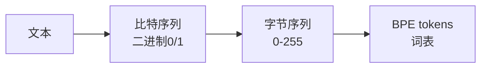

在[上一篇文章](./01-pretraining-data.md)中,我们讨论了如何获取训练数据。今天我们来看看下一步:Tokenization


## 什么是Tokenization?

Tokenization就是一种压缩方式，将许多的数据转化为一个个unique id，便于模型使用

## 为什么需要 Tokenization?

[fine web 的数据raw text](https://huggingface.co/datasets/HuggingFaceFW/fineweb)

我们可以下载其中的一个数据


神经网络不能直接处理文本,它们需要:
1. 一维的符号序列
2. 有限的符号集(vocabulary)
3. 统一的数字格式

## 编码过程是怎样的?

整个过程可以分为这样几步：



### 1. 文本 → 比特序列
- 最基础的二进制表示
- 例如："Hi" → "01001000 01101001"
- 一个字符需要8位二进制数
- 非常低效：5000字符需要40,000位

### 2. 比特 → 字节
- 每8位二进制组成一个字节(0-255)
- 序列长度减少了8倍
- 5000字符现在只需要5000字节
- 但对于大规模文本处理还是不够高效

### 3. 字节 → BPE tokens
- 使用字节对编码(BPE)算法
- 基于频率合并常见字符对
- 生成新的token单位
- GPT-4的词表大小：100,277个tokens
- 5000字符最终只需要约1300个tokens

## 举个例子
我们可以通过[tiktoken](https://tiktokenizer.vercel.app) 察看
```python
"hello world" 会被分成:
- "hello" (ID: 24912)
- " world" (ID: 2375)
```

相关资源:
- [tiktoken](https://tiktokenizer.vercel.app) 